Hi!
I graduated from the Physics and Mathematics Lyceum No. 30. I'm currently studying at ITMO University in the Software engineering program, group M3200.

Stack: C, C++ (Qt, CUDA, openmp, cmake, vcpkg as well), Python, basics of Go, Typst and LaTeX.

GitHub Stats

  

    
    
  

